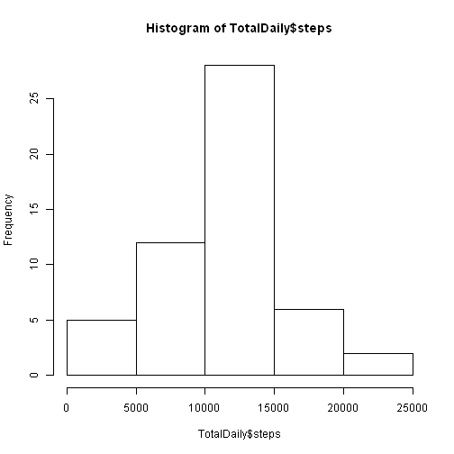
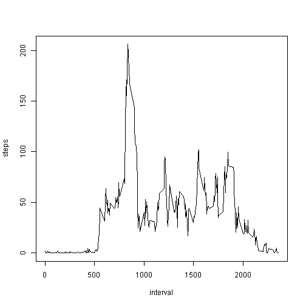
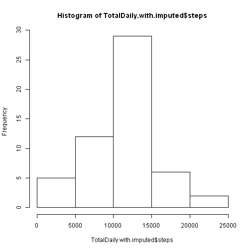
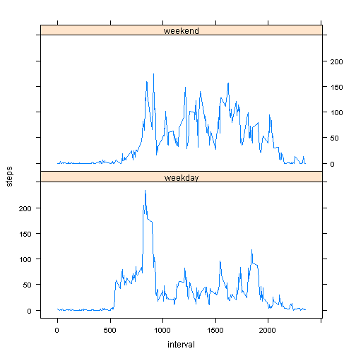

## Loading and preprocessing the data
The dataset, activity.csv was taken from https://d396qusza40orc.cloudfront.net/repdata%2Fdata%2Factivity.zip on the 10 June 2015


```r
setwd("C:/Coursera/RepData_PeerAssessment1")
activity <- read.csv("activity.csv")
```
Pre Process the data - convert dates to usable format

```r
activity$date <-as.Date(activity$date,format="%Y-%m-%d")
```
Summary of the data

```r
summary(activity)
```

```
##      steps             date               interval     
##  Min.   :  0.00   Min.   :2012-10-01   Min.   :   0.0  
##  1st Qu.:  0.00   1st Qu.:2012-10-16   1st Qu.: 588.8  
##  Median :  0.00   Median :2012-10-31   Median :1177.5  
##  Mean   : 37.38   Mean   :2012-10-31   Mean   :1177.5  
##  3rd Qu.: 12.00   3rd Qu.:2012-11-15   3rd Qu.:1766.2  
##  Max.   :806.00   Max.   :2012-11-30   Max.   :2355.0  
##  NA's   :2304
```

###The total number of steps taken per day

```r
TotalDaily <- aggregate(steps ~ date,activity,sum)
TotalDaily
```

```
##          date steps
## 1  2012-10-02   126
## 2  2012-10-03 11352
## 3  2012-10-04 12116
## 4  2012-10-05 13294
## 5  2012-10-06 15420
## 6  2012-10-07 11015
## 7  2012-10-09 12811
## 8  2012-10-10  9900
## 9  2012-10-11 10304
## 10 2012-10-12 17382
## 11 2012-10-13 12426
## 12 2012-10-14 15098
## 13 2012-10-15 10139
## 14 2012-10-16 15084
## 15 2012-10-17 13452
## 16 2012-10-18 10056
## 17 2012-10-19 11829
## 18 2012-10-20 10395
## 19 2012-10-21  8821
## 20 2012-10-22 13460
## 21 2012-10-23  8918
## 22 2012-10-24  8355
## 23 2012-10-25  2492
## 24 2012-10-26  6778
## 25 2012-10-27 10119
## 26 2012-10-28 11458
## 27 2012-10-29  5018
## 28 2012-10-30  9819
## 29 2012-10-31 15414
## 30 2012-11-02 10600
## 31 2012-11-03 10571
## 32 2012-11-05 10439
## 33 2012-11-06  8334
## 34 2012-11-07 12883
## 35 2012-11-08  3219
## 36 2012-11-11 12608
## 37 2012-11-12 10765
## 38 2012-11-13  7336
## 39 2012-11-15    41
## 40 2012-11-16  5441
## 41 2012-11-17 14339
## 42 2012-11-18 15110
## 43 2012-11-19  8841
## 44 2012-11-20  4472
## 45 2012-11-21 12787
## 46 2012-11-22 20427
## 47 2012-11-23 21194
## 48 2012-11-24 14478
## 49 2012-11-25 11834
## 50 2012-11-26 11162
## 51 2012-11-27 13646
## 52 2012-11-28 10183
## 53 2012-11-29  7047
```

###The following histogram shows the distribution of the total number of steps taken per day

```r
hist(TotalDaily$steps)
```

 

###The mean number of steps taken each day is:

```r
mean(TotalDaily$steps)
```

```
## [1] 10766.19
```

###The median number of steps taken each day is:

```r
median(TotalDaily$steps)
```

```
## [1] 10765
```

##average daily activity pattern
Create new dataframe with the average number of steps per interval

```r
DailyAverage <-aggregate(steps ~ interval, activity,mean)
```

###Time Series plot of average number of steps throughout sample

```r
plot(DailyAverage,type='l')
```

 

###The 5 minute interval with the highest average number of steps

```r
DailyAverage[order(DailyAverage$steps,decreasing=T)[1],]
```

```
##     interval    steps
## 104      835 206.1698
```

##Imputing missing values

###The total number of missing values

```r
missing<-subset(activity,is.na(activity$steps))
aggregate(missing$steps, by=list(missing$date), FUN=function(x){NROW(x)})
```

```
##      Group.1   x
## 1 2012-10-01 288
## 2 2012-10-08 288
## 3 2012-11-01 288
## 4 2012-11-04 288
## 5 2012-11-09 288
## 6 2012-11-10 288
## 7 2012-11-14 288
## 8 2012-11-30 288
```

###Impute missing values
Impute missing values by substituting missing value with the average from the corresponding intervals of actual values
Create new dataframe: with.imputed which will contain missing values

```r
with.imputed<-activity
with.imputed$steps[is.na(with.imputed$steps)] <- DailyAverage$steps[is.na(with.imputed$steps)]
```

###Histogram of total daily steps including imputed values
Adding the imputed values increases the number of average days in the middle of the distribution

```r
TotalDaily.with.imputed <- aggregate(steps ~ date,with.imputed,sum)
hist(TotalDaily.with.imputed$steps)
```

 

###The mean number of steps taken each day including imputed values is:

```r
mean(TotalDaily.with.imputed$steps)
```

```
## [1] 10766.19
```

###The median number of steps taken each day including imputed values is:

```r
median(TotalDaily.with.imputed$steps)
```

```
## [1] 10765.59
```
The mean and median have not been significantly influenced by the imputed values

##Activity pattern differences between weekdays and weekends.
###Create new column in dataframe with a factor signifying the day type

```r
activity$weekday <- as.POSIXlt(activity$date)$wday
activity$wday <- as.factor(ifelse(activity$weekday == 6,"weekend",ifelse(activity$weekday == 0,"weekend", "weekday")))
str(activity)
```

```
## 'data.frame':	17568 obs. of  5 variables:
##  $ steps   : int  NA NA NA NA NA NA NA NA NA NA ...
##  $ date    : Date, format: "2012-10-01" "2012-10-01" ...
##  $ interval: int  0 5 10 15 20 25 30 35 40 45 ...
##  $ weekday : int  1 1 1 1 1 1 1 1 1 1 ...
##  $ wday    : Factor w/ 2 levels "weekday","weekend": 1 1 1 1 1 1 1 1 1 1 ...
```

###

```r
DailyAverage.bywday <-aggregate(steps ~ interval+wday, activity,mean)
library(lattice)
xyplot(steps ~ interval|wday, data=DailyAverage.bywday, type='l', layout=c(1,2)  )
```

 
